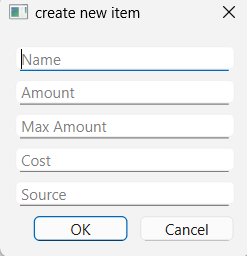
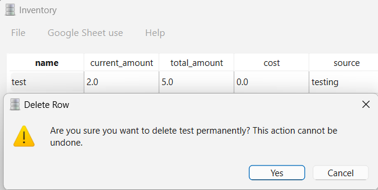
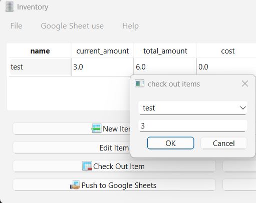
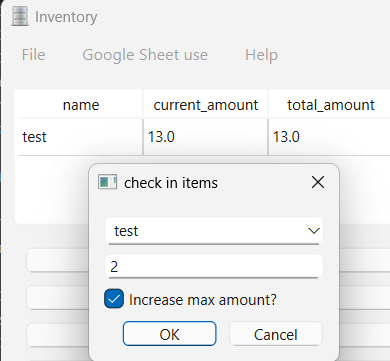
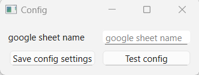
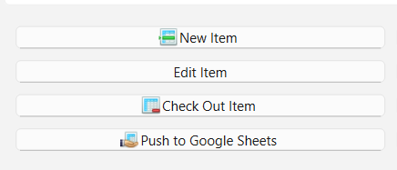

# Help file

## Contents

1. [Introduction](#introduction)
2. [Adding an item](#adding-an-item)
3. [Deleting an item](#deleting-an-item)
4. [Checking items in/out](#checking-items-inout)
5. [Google Sheet use](#5-google-sheets) (beta)

---

## 1. Introduction

Using the inventory app is pretty straightforward. The system relies on you creating an object and filling out the attributes for each item. 

You can then check items in or out as needed to keep track of your inventory.

Support for archiving a snapshot of your inventory on preset dates is coming (Soon&trade;).

***The button for add an attribute is still in development and may break things when pushed.***

## 2. Adding an Item

Select the new item button. 

You will see this screen: 

Fill out the fields as desired. 

Notes:
> fields that take an amount or cost must be numerical- any text values will not be accepted.
>
> if the amount set is higher than the total amount entered, the system will assume the total amount is the current amount instead. If this isn't desired, you can adjust it later using the edit button.

## 3. Deleting an Item

To delete an item, select that item in the table display, then press the delete button.

You will be asked to confirm the deletion before proceeding.

> **THIS IS PERMANENT AND CANNOT BE REVERSED.**
> 
> *unless you choose to not save the inventory before closing. This will not save any other changes though so it is recommended to be sure of your actions when doing this.* 

## 4. Checking items in/out

To check items in or out, select the item in the table display, then press the appropriate button.

> You cannot check out more items than are currently in stock and the system will block you from doing this.
>
> You also cannot check in more items than the total amount of items. You do have the option to increase the total amount during this step if you would like. This increases both the current amount and the total amount of the item by the entered value.

The following will result in a current and total amount of 15.

## 5. Google Sheets

> *This feature is in beta testing and only available to the developers*

This app has the capability to push your changes to a Google Sheet. By configuring your Sheet information and Authentication Tokens, you are able to update an online inventory from the desktop application.

This is currently one-directional and only goes from your application to Google Sheets. Support for two-way communication may come later.

In the config menu, you enter your destination spreadsheet. The table will be uploaded and overwrite any information starting from cell A1.

Press test config. This will check for a credentials token present in your filesystem, then Google will ask you for authentication to refresh your access token. If everything is set up properly, a dialog will confirm it is working.
>It is recommended to save your working config settings. 

You can then use the button to push your inventory to Google Sheets.

